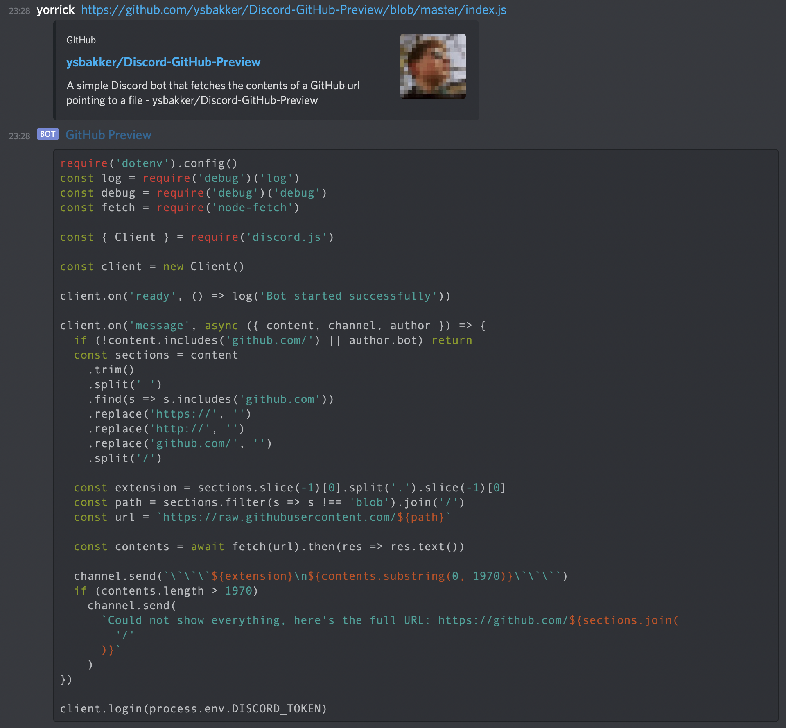

# GitHub Preview Discord Bot

This bot looks for GitHub URLs and will attempt to get the raw filedata.

There are a few limitations (for now):

- Bot only shows the first 2000 (or so) characters, this is a Discord limitation
- The repository needs to be public
- It will use the file extension as the language, which doesn't always work

